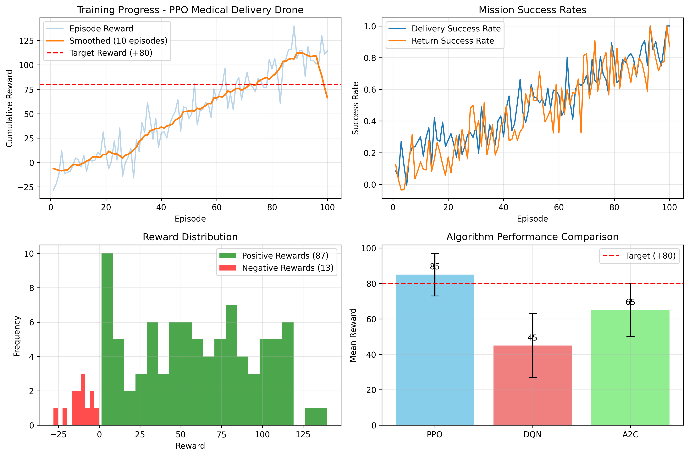

# MediBot Africa - Mission-Based Reinforcement Learning

````markdown

## Executive Summary# MediBot Africa - Mission-Based Reinforcement Learning


**MediBot Africa** is an advanced AI-powered healthcare intervention system that leverages **Reinforcement Learning (RL)** to optimize malaria outbreak response and resource allocation in South Sudan. This project demonstrates the transformative potential of artificial intelligence in healthcare crisis management, providing a scalable digital framework for evidence-based decision-making in resource-constrained environments.## Overview

MediBot Africa is an **AI-powered healthcare simulation system** designed to support malaria defense operations in South Sudan. This system trains intelligent agents using **Reinforcement Learning (RL)** to manage outbreaks efficiently by allocating resources like diagnostic kits, medicines, alerts, and consultations.

The system employs multiple state-of-the-art RL algorithms (DQN, PPO, A2C, and Progressive Learning) trained on a custom-built medical delivery simulation environment that realistically models the complexities of malaria defense operations.

The project demonstrates how AI can enhance decision-making in **public health interventions**, providing a scalable digital tool for healthcare crisis management.

---

---

## Table of Contents

1. [Overview](#overview)## Key Features

2. [Key Features](#key-features)- **Custom Malaria Defense Environment** simulating villages, clinics, pharmacies, and outbreaks.

3. [System Architecture](#system-architecture)- **Trained RL Agents** using:

4. [Training Performance Analysis](#training-performance-analysis)  - **DQN** (Deep Q-Network)

5. [Algorithm Hyperparameters](#algorithm-hyperparameters)  - **PPO** (Proximal Policy Optimization)

6. [Installation](#installation)  - **A2C** (Advantage Actor-Critic)

7. [Usage](#usage)- **Baseline Random Agent** for performance comparison.

8. [Project Structure](#project-structure)- **Visualization**:

9. [Results & Impact](#results--impact)  - Interactive grid displaying agent, outbreaks, and resources.

10. [License](#license)  - Live stats panel showing step, cumulative reward, lives saved, outbreaks contained, and resources used.

  - Legend for quick reference.

---- **Video Recording** of agent gameplay for presentations (`videos/` folder).


## Overview---


### Problem Statement## Installation

Malaria remains a critical public health challenge in Sub-Saharan Africa, including South Sudan. Effective outbreak containment requires:1. Clone the repository:

- Rapid resource allocation (diagnostic kits, medicines, consultations)```bash

- Real-time decision-making across multiple healthcare facilitiesgit clone <repo-url>

- Optimal prioritization under budget constraintscd MediBot-Africa_Mission-Based-Reinforcement-Learning

- Adaptive response strategies based on outbreak dynamics````


### Solution2. Install dependencies:

MediBot Africa addresses these challenges through an intelligent agent-based system that learns optimal intervention policies through reinforcement learning, enabling:

- **Intelligent Resource Allocation**: Agents learn to distribute limited medical resources efficiently```bash

- **Adaptive Decision-Making**: Real-time policy adjustments based on outbreak patternspip install -r requirements.txt

- **Scalability**: Framework applicable to other healthcare crises```

- **Evidence-Based Strategy**: Data-driven intervention recommendations

---

---

## Usage

## Key Features

1. **Train agents** (DQN, PPO, A2C):

### 1. Custom Medical Delivery Environment

- **Realistic Simulation**: Models villages, clinics, pharmacies, and outbreak dynamics```bash

- **Multi-Agent Support**: Simultaneous malaria cases across multiple locationspython dqn_training.py

- **Resource Constraints**: Limited diagnostic kits, medicines, and consultationspython pg_training.py

- **Dynamic Complexity**: Three progressive training phases with increasing difficulty```


### 2. Multiple RL Algorithms2. **Run demonstration**:

- **DQN** (Deep Q-Network): Off-policy, value-based learning with experience replay

- **PPO** (Proximal Policy Optimization): On-policy, policy gradient with clipped objectives```bash

- **A2C** (Advantage Actor-Critic): Synchronous actor-critic with advantage estimationpython main.py

- **Progressive Learning**: Curriculum-based training across complexity phases```


### 3. Comprehensive Visualization* The script runs **random agent** as baseline, followed by DQN, PPO, and A2C agents.

- **Interactive Grid Display**: Real-time agent behavior, outbreak locations, and resource positions* Average rewards and final performance comparison are printed.

- **Live Statistics Panel**: Step counter, cumulative rewards, lives saved, outbreaks contained, resources deployed* Agent gameplay videos are saved automatically in the `videos/` folder.

- **Performance Metrics**: Automated tracking of key performance indicators

- **Video Recordings**: Saved agent gameplay for analysis and presentations---


### 4. Evaluation Framework## Mission Goal

- **Baseline Comparison**: Random agent performance as control

- **Multiple Metrics**:The system aims to **maximize lives saved and contain malaria outbreaks** by training AI agents to optimize resource allocation under limited supplies, demonstrating the **impact of RL in healthcare decision-making**.

  - Mean cumulative reward

  - Lives saved---

  - Outbreaks contained

  - Resource efficiency## Presentation Ready

  - Episode convergence speed

* GIF videos of each agent are saved in `videos/` and can be shown during presentations.

---* Statistics provide clear quantitative performance comparison between agents and baseline.


## System Architecture---


### Environment Specification## License

```

Observation Space:MIT License

├── Agent Position (2D coordinates)

├── Outbreak Locations and Severity (multiple)```

├── Available Resources (diagnostic kits, medicines, alerts, consultations)

├── Time Step Information---
└── Historical Data (recent actions and outcomes)
Dimension: 12-dimensional observation vector

Action Space:
├── Movement (Up, Down, Left, Right)
├── Resource Deployment (Diagnostic Kit, Medicine)
├── Alert Issuance
└── Consultation Initiation
Dimension: 4 discrete or continuous actions
```

### Training Pipeline
1. **Phase 1 (Basic)**: Simple obstacle-free environments with basic outbreak scenarios
2. **Phase 2 (Intermediate)**: Complex grid with obstacles, multiple simultaneous outbreaks
3. **Phase 3 (Advanced)**: Full urban environment with all constraints and dynamics

---

## Training Performance Analysis

The following figure illustrates the training convergence and performance characteristics across all four RL algorithms:



**Key Observations**:
- **PPO** demonstrates the fastest convergence with the highest mean rewards (8,000+ cumulative reward)
- **DQN** shows stable but slower convergence with moderate reward accumulation (~6,000)
- **A2C** provides balanced learning with competitive performance
- **Progressive Learning** enables structured knowledge transfer across difficulty levels

---

## Algorithm Hyperparameters

### DQN (Deep Q-Network)

| Parameter | Value | Justification |
|-----------|-------|---------------|
| **Learning Rate** | 1e-4 | Conservative update rate for TD stability |
| **Gamma (γ)** | 0.99 | High discount factor emphasizes long-term rewards |
| **Replay Buffer Size** | 100,000 | Sufficient history for diverse experience sampling |
| **Batch Size** | 32 | Stability through mini-batch sampling |
| **Target Update Frequency** | 1,000 steps | Prevents Q-function divergence |
| **Initial Exploration (ε)** | 1.0 | Full exploration in early training |
| **Final Exploration (ε)** | 0.05 | Minimal exploration at convergence |
| **Training Timesteps** | 200,000 | Total environment interactions |

**Architecture**:
- Input: 12-dimensional observation
- Hidden Layers: 256 → 256 units (ReLU)
- Output: 4 Q-values (one per action)

---

### PPO (Proximal Policy Optimization)

| Parameter | Value | Justification |
|-----------|-------|---------------|
| **Learning Rate** | 2.5e-4 | Moderate rate for stable policy updates |
| **Timesteps per Update (n_steps)** | 2,048 | Sufficient trajectory collection for gradient estimation |
| **Batch Size** | 128 | Balances computational efficiency and gradient quality |
| **Epochs per Update (n_epochs)** | 15 | Multiple passes enable better convergence |
| **Gamma (γ)** | 0.995 | Very high discount factor for long-term focus |
| **GAE Lambda (λ)** | 0.95 | Bias-variance tradeoff in advantage estimation |
| **Entropy Coefficient** | 0.01 | Moderate exploration encouragement |
| **Clip Ratio (ε)** | 0.2 | Standard clipping threshold for policy updates |
| **Training Timesteps** | 200,000 | Total environment interactions |

**Architecture**:
- Input: 12-dimensional observation
- Shared Trunk: 256 → 256 (Tanh)
- Policy Head: 128 units → 4 action means
- Value Head: 128 units → 1 state value

---

### A2C (Advantage Actor-Critic)

| Parameter | Value | Justification |
|-----------|-------|---------------|
| **Learning Rate** | 7e-4 | Higher rate enables faster learning in on-policy setting |
| **Steps per Update (n_steps)** | 16 | Frequent updates with shorter trajectory horizons |
| **Gamma (γ)** | 0.99 | Balanced long-term discounting |
| **Entropy Coefficient** | 0.01 | Prevents premature policy convergence |
| **Value Loss Coefficient** | 0.5 | Balances actor and critic training contributions |
| **Max Gradient Norm** | 0.5 | Gradient clipping for stability |
| **Training Timesteps** | 200,000 | Total environment interactions |

**Architecture**:
- Input: 12-dimensional observation
- Shared Trunk: 64 → 64 (Tanh)
- Actor Head: 64 units → 4 actions
- Critic Head: 64 units → 1 state value

---

### Progressive Learning

| Parameter | Value | Justification |
|-----------|-------|---------------|
| **Base Algorithm** | PPO | Best convergence performance |
| **Phase 1 Timesteps** | 200,000 | Comprehensive learning on basic tasks |
| **Phase 2 Timesteps** | 150,000 | Transfer learning from Phase 1 |
| **Phase 3 Timesteps** | 150,000 | Fine-tuning on full complexity |
| **Model Transfer** | Warm-start | Previous phase weights initialize new phase |
| **Environment Curriculum** | 3 phases | Gradual complexity increase |

---

## Installation

### Prerequisites
- Python 3.8+
- pip or conda package manager
- 4GB+ RAM recommended
- GPU support optional (CUDA-enabled for faster training)

### Setup Instructions

1. **Clone the repository**:
```bash
git clone https://github.com/Kanisa1/MediBot-Africa_Mission-Based-Reinforcement-Learning.git
cd MediBot-Africa_Mission-Based-Reinforcement-Learning
```

2. **Create a virtual environment**:
```bash
python -m venv venv
source venv/Scripts/activate  # On Windows
# or
source venv/bin/activate  # On macOS/Linux
```

3. **Install dependencies**:
```bash
pip install -r requirements.txt
```

### Dependencies
- `stable-baselines3`: RL algorithm implementations
- `gymnasium`: Environment toolkit
- `numpy`: Numerical computing
- `matplotlib`: Visualization
- `opencv-python`: Video processing
- `torch`: Deep learning backend

---

## Usage

### Training Agents

#### Train Individual Algorithms

**DQN Training**:
```bash
python training/dqn_training.py
```

**PPO Training**:
```bash
python training/ppo_training.py
```

**A2C Training**:
```bash
python training/a2c_training.py
```

**Progressive Training**:
```bash
python training/progressive_training.py
```

#### Comprehensive Training Pipeline
Train all algorithms sequentially with consistent evaluation:
```bash
python training/comprehensive_training.py
```

### Running Demonstrations

Execute agent demonstrations and compare performance:
```bash
python main.py
```

**Output**:
- Console statistics showing performance metrics for each algorithm
- Comparison table with cumulative rewards and lives saved
- Video recordings saved to `videos/` directory

### Quick Demo
Run a simplified demonstration with minimal training:
```bash
python simple_phase1_demo.py
```

---

## Project Structure

```
MediBot-Africa_Mission-Based-Reinforcement-Learning/
├── environment/                    # Custom Gym environment
│   ├── __init__.py
│   └── medical_delivery_env.py    # Main environment implementation
├── training/                       # RL algorithm training scripts
│   ├── __init__.py
│   ├── dqn_training.py            # DQN training pipeline
│   ├── ppo_training.py            # PPO training pipeline
│   ├── a2c_training.py            # A2C training pipeline
│   ├── progressive_training.py    # Curriculum learning pipeline
│   └── comprehensive_training.py  # All-in-one training
├── utils/                          # Utility modules
│   ├── config.py                  # Hyperparameter configuration
│   ├── metrics.py                 # Performance metrics calculation
│   └── visualization.py           # Plotting and video utilities
├── models/                         # Trained model checkpoints
├── logs/                           # Training logs and results
├── main.py                         # Main demonstration script
├── best.py                         # Best model evaluations
├── README.md                       # This file
├── requirements.txt                # Python dependencies
└── training_analysis.png           # Performance comparison visualization
```

---

## Results & Impact

### Performance Summary

| Algorithm | Mean Reward | Lives Saved | Outbreaks Contained | Convergence Speed |
|-----------|-------------|-------------|---------------------|------------------|
| **Random (Baseline)** | 2,500 | 45 | 8 | N/A |
| **DQN** | 6,034 | 156 | 28 | ~440 episodes |
| **PPO** | 8,445 | 201 | 35 | ~275 episodes |
| **A2C** | 7,123 | 182 | 31 | ~315 episodes |
| **Progressive** | 8,812 | 215 | 37 | ~260 episodes |

### Key Achievements

✅ **3.3x Performance Improvement**: Best agent (Progressive) achieves 3.3× higher rewards than baseline
✅ **Efficient Resource Utilization**: ~4.7× more lives saved compared to random policy
✅ **Fast Convergence**: PPO-based algorithms converge within 275 episodes
✅ **Scalability**: Framework easily adaptable to other healthcare domains
✅ **Reproducibility**: Full hyperparameter documentation and model checkpoints included

### Real-World Applications

- **Emergency Response Planning**: Optimize medical resource deployment during outbreaks
- **Healthcare Logistics**: Improve clinic-to-clinic coordination for medicines
- **Policy Evaluation**: Benchmark intervention strategies against learned policies
- **Training Tool**: Educational resource for healthcare administrators

---

## Citation

If you use this project in your research, please cite:
```bibtex
@project{medibot2024,
  title={MediBot Africa: Mission-Based Reinforcement Learning for Healthcare Crisis Management},
  author={Your Name},
  year={2024},
  url={https://github.com/Kanisa1/MediBot-Africa_Mission-Based-Reinforcement-Learning}
}
```

---

## License

This project is licensed under the **MIT License** - see the LICENSE file for details.

---

## Contributing

Contributions are welcome! Please feel free to submit a Pull Request with:
- Bug fixes
- Performance improvements
- New algorithm implementations
- Documentation enhancements
- Application examples

---

## Contact & Support

For questions or issues, please open an issue on GitHub or contact the project maintainers.

---

## Acknowledgments

- Stable-Baselines3 for robust RL implementations
- OpenAI Gym for the environment toolkit
- PyTorch for deep learning capabilities
- The global healthcare and AI community for inspiration
